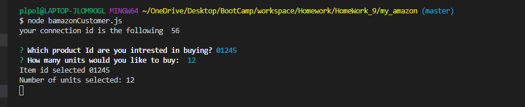
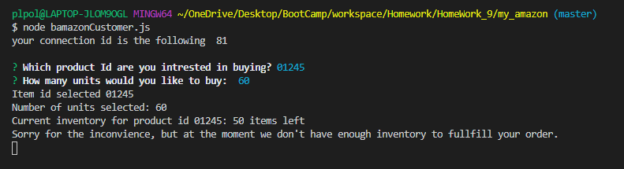

# Node.js & MySQL

### Overview

This application has the capability to handle user orders. Once user input is submitted the application will connect with an sql database to pull down data about the requested product. In addition the application will update the database to reflect the depleted stock.

Technologies used -
SQL - used to create bamazon database, which will hold our data.
Inquierer - technology that allows us to interact with the user.  
Node - The spine of our application that is enables us to connect with our database and with our user's requst.

## Application Walkthrough

- MySQL bamazon database including products table created in MySQL Workbench
  

- To get started please complete the following
    1. Open my_amazon folder in your favorite terminal.
    1. In the terminal input the following 'npm install' (installs all dependecies that the application requires to run)
    2. Once dependecies are install you are ready to start the application please run 'bamazonCustomer.js' in your terminal to initiate 

- Inital connection with our database using our application
  

- Using Inquierer the applications interacts with the user. Asking which product id they would be intrested in buying and how many units would they be willing to purchase
  

- Once the above step is complete the application will fetch the current inventory for the selected product Id. 
    
    Route A (failed purchase): If inventory is less than the requested amount the application will alert the user that the order cannot be filled.
        
    

    Route B (successful purchase): If inventory is able to cover the requested amount of item(s) the user wishes to purchase, the transaction will be fulfilled.
        The user will be alerted that the transaction was sucessfully completed, along with a summary that will provide the user with his total amount and the remaining inventory for that particular item. 
    